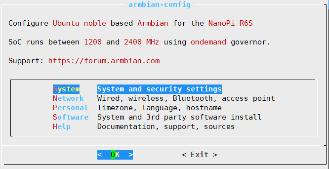
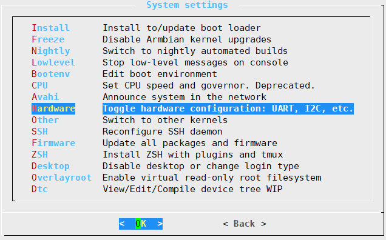
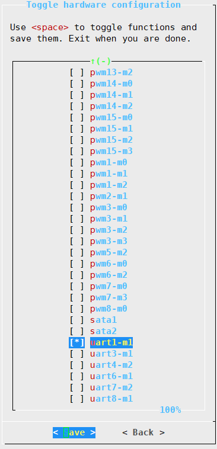

# Building a Time Server (PTP/NTP) using NanoPi R6C with GNSS and PPS
## Setting Up NanoPi R6C
### Install ArmbianOS
Download the OS image from [Armbian's NanoPi R6S/R6C page](https://www.armbian.com/nanopi-r6s/) and flash it to an SD card. Boot the device using the SD card and complete the initial setup. Then, run ```sudo armbian-install``` to install the OS to eMMC.

**Edit Device Tree** 
In ```/boot/armbianEnv.txt```, replace ```fdtfile=rockchip/rk3588s-nanopi-r6s.dtb``` with ```fdtfile=rockchip/rk3588s-nanopi-r6c.dtb```

### NanoPi R6C GPIO
Change directory to ```/sys/class/gpio/```
```sh
for i in gpiochip*; do echo `cat $i/label`: `cat $i/base`; done
```
```sh
gpio0: 0
gpio1: 32
gpio2: 64
gpio3: 96
gpio4: 128
```
**Convert GPIO Pin Name to GPIO Pin Number**

<table>
  <tr>
    <th colspan="4">X (Group)</th>
    <th colspan="5">Y (GPIO Chip Label)</th>
    <th>Z</th>
  </tr>
  <tr>
    <td>A</td><td>B</td><td>C</td><td>D</td>
    <td>GPIO0</td><td>GPIO1</td><td>GPIO2</td><td>GPIO3</td><td>GPIO4</td>
    <td>-</td>
  </tr>
  <tr>
    <td>1</td><td>2</td><td>3</td><td>4</td>
    <td>0</td><td>32</td><td>64</td><td>96</td><td>128</td>
    <td>-</td>
  </tr>
</table>


To convert the GPIO Pin Name (e.g., ```GPIO4_A3``` or ```GPIO1_B1```) into a GPIO Pin Number, use 
```
Pin Number = Y + (X - 1) * 8 + Z
``` 
For example, 
```
GPIO4_A3 = 128 + (1-1) * 8 + 3 = 131
GPIO1_B1 = 32  + (2-1) * 8 + 1 = 41
```

**Pin Definitions**
```sh
sudo cat /sys/kernel/debug/gpio
```
```sh
gpiochip0: GPIOs 0-31, parent: platform/fd8a0000.gpio, gpio0:

gpiochip1: GPIOs 32-63, parent: platform/fec20000.gpio, gpio1:
 gpio-35  (                    |pps@0               ) in  lo IRQ 
 gpio-39  (                    |reset               ) out hi 
 gpio-48  (                    |User                ) in  hi IRQ ACTIVE LOW
 gpio-49  (                    |sys_led             ) out lo 
 gpio-50  (                    |wan_led             ) out lo 
 gpio-51  (                    |lan1_led            ) out lo 
 gpio-52  (                    |user_led            ) out lo 
 gpio-58  (                    |vcc5v0-usb-otg0-regu) out hi 

gpiochip2: GPIOs 64-95, parent: platform/fec30000.gpio, gpio2:

gpiochip3: GPIOs 96-127, parent: platform/fec40000.gpio, gpio3:
 gpio-111 (                    |PHY reset           ) out hi ACTIVE LOW
 gpio-121 (                    |reset               ) out hi 

gpiochip4: GPIOs 128-159, parent: platform/fec50000.gpio, gpio4:
 gpio-140 (                    |vcc-3v3-sd-s0-regula) out lo 
 gpio-141 (                    |vcc5v0-host-20-regul) out hi
```

### Configure Overlay
**Enable UART Overlay**
```sh
sudo armbian-config
```



Then, reboot
**Create PPS Overlay**
Create the DT overlay, ```pps-overlay.dts```, for PPS signal on pin GPIO1_A3 or pin35 
```conf
/dts-v1/;
/plugin/;

/ {
  compatible = "friendlyelec,nanopi-r6c\0rockchip,rk3588s";

  fragment@0 {
    target-path = "/";
    __overlay__ {
      pps: pps@0 {
        compatible = "pps-gpio";
        gpios = <&gpio1 3 0>; #GPIO1_A3
      };
    };
  };
};
```

Activate the overlay
```sh
sudo armbian-add-overlay pps-overlay.dts 
```

Verify that the PPS overlay is activated
```sh
sudo dmesg | grep pps
```
```sh
[    5.196708] pps pps0: new PPS source pps@0.-1
[    5.196733] pps pps0: Registered IRQ 151 as PPS source
```


**The NanoPi is now configured and ready to function as an NTP server.**

### Install RTL8125 driver 
The driver can be found at [2.5G Ethernet LINUX driver r8125](https://www.realtek.com/Download/List?cate_id=584) or download the version used in this experiment directly from [r8125-9.014.01 driver](<r8125 driver/r8125-9.014.01.tar.bz2>)

Extract the driver
```sh
tar -xvjf r8125-9.014.01.tar.bz2
```
go to ```/src``` directory and edit the ```Makefile``` to enable PTP support
```sh
ENABLE_PTP_SUPPORT = y
ENABLE_PTP_MASTER_MODE = y
```
Install the driver
```sh
./autorun.sh
```


> If the installation fails due to missing Linux headers, you need to install the appropriate Linux header files.
> ```
> sudo armbian-config > Software > Header_install
> ```
> If your Linux headers do not match the Linux kernel version, the driver may be installed in a different directory. In such cases, you need to move the driver to the directory corresponding to your system's Linux kernel version.
> 
> For example, move the driver from:
> ```
> /usr/lib/modules/6.10.6-current-rockchip-rk3588/kernel/drivers/net/ethernet/realtek/r8125.ko
>```
> to:
>```
>/usr/lib/modules/6.10.10-current-rockchip-rk3588/kernel/drivers/net/ethernet/realtek/r8125.ko
>```
> To ensure the driver is loaded at boot, create a new file named ```/etc/modules-load.d/r8125.conf``` and add the following line inside:
> ```
> r8125
>```


**Verify the r8125 driver installation**
```sh
lsmod | grep r8125
```
```sh
r8125                 221184  0
```
```sh
sudo ethtool -T [interface_name]
```
The output should show the ptp clock:
```sh
Time stamping parameters for lan:
Capabilities:
	hardware-transmit
	software-transmit
	hardware-receive
	software-receive
	software-system-clock
	hardware-raw-clock
PTP Hardware Clock: 0
Hardware Transmit Timestamp Modes:
	off
	on
Hardware Receive Filter Modes:
	none
	ptpv2-l4-event
	ptpv2-l4-sync
	ptpv2-l4-delay-req
	ptpv2-event
	ptpv2-sync
	ptpv2-delay-req
```
```sh
ls /dev/ptp*
```
```sh
/dev/ptp0  
```

**Edit interface name (Optional)**

The interface name can be changed using udev by editing the file: ```/etc/udev/rules.d/70-persistent-net.rules```

For example, the ```KERNELS``` value corresponds to the PCI address of the RTL8125, which can be identified using the command: ```lspci```.
```sh
SUBSYSTEM=="net", ACTION=="add", KERNELS=="0003:31:00.0", NAME:="lan"
```
Reboot and try ```ifconfig```

## Set up NTP Server

Details on building an NTP server can be found in the guide [Building a NTP Server using Raspberry Pi](https://github.com/PatchapongKul/RPI-NTP-server). However, there are adjustments to the GPSD configuration based on hardware capabilities.

Specifically, the ```-s 115200``` option is added to ```GPSD_OPTIONS``` because the GNSS module requires a baud rate of 115200. At the default baud rate of 9600, the data stream is too slow, causing a significant time offset (~13 seconds).

```bash
# Devices gpsd should collect to at boot time.
# They need to be read/writeable, either by user gpsd or the group dialout.
START_DAEMON="true"
DEVICES="/dev/ttyS1 /dev/pps0"

# Other options you want to pass to gpsd
GPSD_OPTIONS="-n -s 115200"

# Automatically hot add/remove USB GPS devices via gpsdctl
USBAUTO="true"
```

Since the GNSS module defaults to a baud rate of 9600, ```ubxtool``` is used to update the baud rate to 115200. First, install the required dependency:
```sh
sudo apt install setserial
```
Editing the ```gpsd``` Service
```sh
sudo systemctl edit gpsd
```
Insert the following lines into the service configuration:
```sh
[Service]
ExecStartPre=/usr/bin/setserial /dev/ttyS1 low_latency
ExecStartPre=/usr/bin/ubxtool -f /dev/ttyS1 -P 18 -s 9600 -S 115200
```

# References
https://www.armbian.com/nanopi-r6s/
https://wiki.friendlyelec.com/wiki/index.php/NanoPi_R6C
https://wiki.friendlyelec.com/wiki/index.php/GPIO
https://gist.github.com/mill1000/44172617640c9b66cf7cd682f8b8ba51
https://github.com/PatchapongKul/RPI-NTP-server
https://www.crc.id.au/2024/09/21/simple-and-cheap-stratum-1-ntp-with-gps/